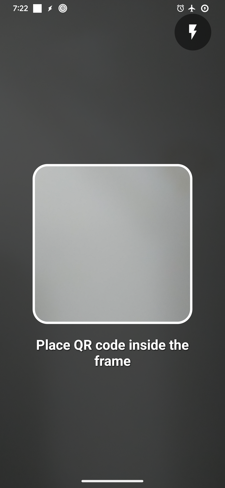
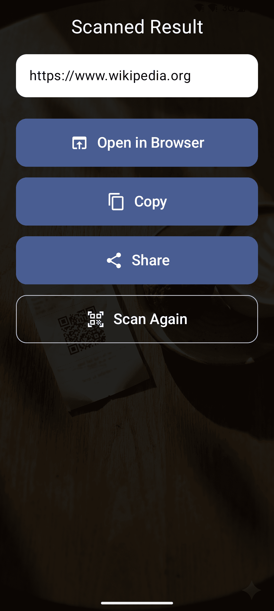

# QRieux

A simple, ad-free QR code scanner designed for everyone — especially our parents and grandparents.

<p align="center">
  
  
</p>

## Why QRieux?

Finding a QR code scanner that is simple, ad-free, free, and privacy-respecting is nearly impossible. So I built one.

- **No ads** — clean experience, no distractions
- **No tracking** — your data stays on your device
- **Simple UI** — large buttons, obvious actions
- **Smart actions** — open links, call phones, send emails, connect to WiFi, copy, share
- **Gallery scanning** — scan QR codes from photos
- **Share to scan** — share images from other apps to scan
- **Multilingual** — English, French, Arabic

## Coming Soon

- Generate your own QR codes
- Security warnings for suspicious links (anti-phishing)

## Tech Stack

- Kotlin Multiplatform + Compose Multiplatform
- CameraX for camera capture
- ML Kit for barcode scanning
- Material3 for UI

## Build

```bash
# Debug build
./gradlew :composeApp:assembleDebug

# Release build (requires key.properties)
./gradlew :composeApp:assembleRelease

# Run tests
./gradlew :composeApp:testDebugUnitTest
```

## Testing

Open [examples/test-qr-codes.html](examples/test-qr-codes.html) in a browser to test scanning all supported QR code types (URLs, emails, phones, WiFi, plain text).

## Contributing

Contributions welcome! Please open an issue first to discuss what you'd like to change.

## License

[MIT](LICENSE)
